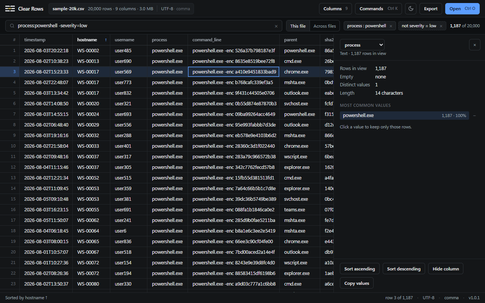
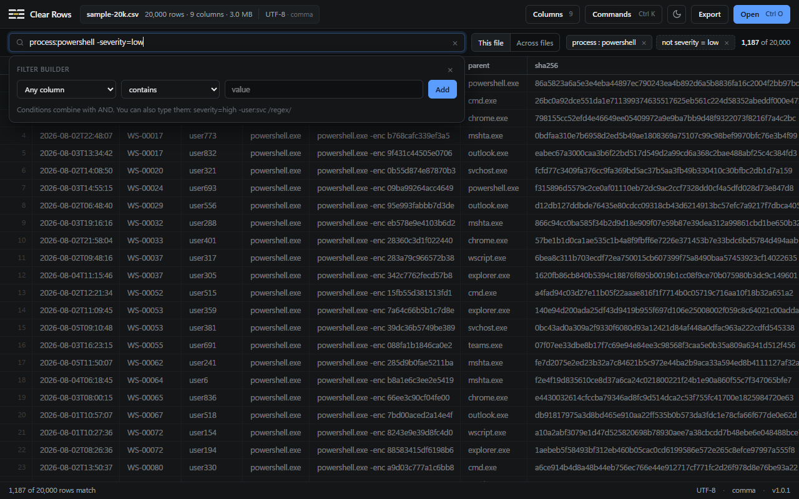

# Clear Rows

Open a multi-gigabyte CSV and be working in it within a second.

Clear Rows is a local desktop viewer for large delimited exports: incident timelines, endpoint inventories, regulator dumps, log extracts. It is for the moment when a spreadsheet chokes, grep is too blunt, and you still need to find the rows that matter. Files never leave your machine.



## The journey

Every session follows the same four steps, and the interface is arranged around them.

### 1. Open

Drop a file on the window, pick one, or double-click a `.csv` or `.tsv` after installing. Files open progressively: the first rows are on screen while the rest indexes in the background, and the grid never freezes.

- Encodings are detected properly: UTF-8, UTF-16 with or without a BOM, and legacy codepages such as windows-1252 and shift_jis. Override any of it from the file chip.
- Files without a header row are recognised and get numbered columns instead of a record promoted to the header. Switch it under the file name if the guess is wrong.
- Gzip-compressed files (`.csv.gz`) open directly.
- Delimiters are detected too: comma, semicolon, tab, pipe, and friends.

### 2. Understand

Columns are typed from the first rows. Numbers right-align, dates sort as dates, and the type shows in the header tooltip and the column menu.

Choose **Inspect column** from a column menu or the command palette to open the column pane: rows in view, empties, distinct values, and a type-aware range (smallest to largest and the sum for numbers, earliest to latest for dates, length for text), then the most common values with counts and shares. The pane recounts whenever the filter changes, and a switcher at the top moves to the next column.

### 3. Narrow

Click the filter box for the builder: pick a column, a condition and a value, or take the word you typed and search everywhere or in one column. Or type the grammar directly:

| Type this | Meaning |
|---|---|
| `powershell` | rows where any cell contains powershell |
| `"lateral movement"` | a phrase with a space |
| `process:chrome` | column contains |
| `severity=high` | column equals |
| `-user:svc` | exclude rows where column contains |
| `hostname:/^WS-00[0-4]/` | regular expression |
| `"Command Line":-enc` | column names with spaces, in quotes |
| `#3:error` | column by position |
| `notes=""` | empty cells |

Conditions combine with AND and show as removable chips. Column names forgive case, spaces and underscores, and accept unique prefixes. Filters you have applied to a file before are offered in the builder while the box is empty.

In the column pane, clicking a value keeps only those rows; the minus excludes them. Sort by one column, or several with the column menu.

### 4. Act

Export exactly what you are looking at as CSV, copy a cell or a whole row (`Ctrl C`, `Ctrl Shift C`), copy the top values from the column pane, or search the same term across many files at once from **Across files**.



## Install

Windows, macOS and Linux builds are on the [releases page](https://github.com/edwynmoss/clear-rows/releases/latest).

- Windows: `Clear Rows_x.y.z_x64-setup.exe` installs for your account with no administrator prompt. An MSI is also attached for managed installs.
- macOS: the universal `.dmg`.
- Linux: `.AppImage`, `.deb` or `.rpm`.

From 1.0.1 on the app checks for a newer release a few seconds after launch and offers it in a toast; one click installs it and restarts. **Check for updates** is also in the command palette.

The Windows and macOS builds are not yet code-signed, so expect a SmartScreen or Gatekeeper prompt on first launch.

## Keyboard

| Keys | Action |
|---|---|
| `Ctrl K` | Command palette (every command lives here) |
| `Ctrl O` | Open a file |
| `Ctrl F` | Filter this file |
| `Ctrl Shift F` | Search across files |
| `Ctrl G` | Go to row |
| `Ctrl E` | Export the current view |
| `Enter` | Cell detail for the highlighted cell |
| `Ctrl C` / `Ctrl Shift C` | Copy cell / copy row |
| `Esc` | Close the builder or pane, then clear the filter |
| Arrows, `Page Up`, `Page Down`, `Home`, `End` | Move the highlight |

## Performance

Measured on a 2,000,000-row, 308 MB file, release build, 16 cores:

| Operation | Time |
|---|---|
| Open, first rows visible | under 10 ms |
| Index to completion | 0.6 s |
| Filter | 0.2 s |
| Sort by one column | 2.0 s |
| Search across the file | 0.7 s |
| Export 400,000 filtered rows | 0.9 s |
| Open the same data as UTF-16 (616 MB) | 0.8 s |

The engine memory-maps the file, keeps a checkpoint every 1,024 rows, and scans blocks in parallel for filtering, sorting, searching, exporting and column statistics. Non-UTF-8 files are transcoded once into a cache; UTF-16 and single-byte codepages decode in parallel.

## Development

```bash
npm install
npm run tauri dev
```

| Command | What it runs |
|---|---|
| `npm test` | Frontend unit tests (vitest, jsdom) |
| `npm run test:rust` | Rust tests |
| `npm run e2e` | Drives the real desktop app over CDP through JSON scenarios; screenshots land in `e2e-output/` |
| `npm run dev` | The interface in a plain browser against an in-memory shim, no Rust needed |
| `npm run tauri build` | Installers, into `src-tauri/target/release/bundle/` |

Performance harness on a large file:

```bash
CLEAR_ROWS_BIG=path/to/big.csv cargo test --release perf_timing -- --ignored --nocapture
```

Local release builds sign the updater artifacts and need the project key:

```bash
TAURI_SIGNING_PRIVATE_KEY="$(cat ~/.tauri/clear-rows.key)" TAURI_SIGNING_PRIVATE_KEY_PASSWORD="" npm run tauri build
```

### Layout

- `src-tauri/src/csv/` is the engine: `scan.rs` (memory-mapped row scanner and block index), `document.rs` (open, index, random access), `filter/` (grammar and parallel scan), `sort.rs`, `search.rs`, `export/`, `stats.rs` (column pane), `types.rs` (column typing), `header.rs` (header detection), `profile.rs` (encoding and delimiter detection).
- `src/app/mount-application.ts` wires the interface; components live in `src/components/`; the browser shim is `src/tauri/browser-shim.ts`.
- `src-tauri/installer/` holds the installer artwork and NSIS hooks, generated by `scripts/installer-art.py`.

### Releasing

Bump the version in `package.json`, `src-tauri/Cargo.toml` and `src-tauri/tauri.conf.json`, commit, and push a `vX.Y.Z` tag. The release workflow builds Windows, macOS and Linux, runs both test suites, signs the update artifacts and creates a draft release with the installers and `latest.json`. Publishing the draft is what makes running copies start offering the update.

## Privacy

Everything happens on your machine. The only network request the app makes is the update check against GitHub Releases, and it sends nothing about you or your files.

## License

MIT
